# Samsung Checkout Automation Framework

## Overview

This project is an automated end-to-end checkout framework created for the Samsung ecommerce assignment.

The objective is to validate that a customer can:

- Initialize a storefront session
- Add a target SKU to the cart through the provided endpoint
- Open the cart and confirm the SKU is present
- Continue as a Guest user
- Fill personal information
- Enable and complete the delivery address section
- Select a delivery mode
- Accept the required terms and conditions
- Open the credit/debit card payment method
- Fill payment details using Mercado Pago test-card data
- Submit the order
- Validate the confirmation page
- Capture the generated order number

The framework was developed using **Selenium WebDriver with Java**, following the **Page Object Model (POM)** architecture.

---

# Technologies Used

| Technology | Purpose |
|---|---|
| Java | Programming language |
| Selenium WebDriver | Browser automation |
| TestNG | Test execution framework |
| Maven | Dependency management |
| WebDriverManager | Automatic browser driver setup |
| IntelliJ IDEA | Development environment |
| Git + GitHub | Version control |
| Chrome DevTools | Environment investigation and debugging |

---

# Framework Architecture

The framework follows a **Page Object Model (POM)** design pattern to improve maintainability, readability, and scalability.

## Main Components

```text
src/test/java
│
├── base
│   ├── BaseTest.java
│   └── DriverFactory.java
│
├── config
│   └── ConfigReader.java
│
├── models
│   ├── TestCardData.java
│   └── TestCustomerData.java
│
├── pages
│   ├── BasePage.java
│   ├── CartPage.java
│   ├── GuestPage.java
│   ├── CheckoutPage.java
│   └── ConfirmationPage.java
│
├── tests
│   ├── SmokeTest.java
│   └── CheckoutTest.java
│
└── utils
    ├── ScreenshotUtils.java
    └── TestDataGenerator.java
```

---

# Framework Features

## Implemented Features

- Selenium WebDriver integration
- TestNG test execution
- Page Object Model architecture
- Centralized driver management
- Reusable explicit waits and page interactions
- Dynamic guest e-mail generation
- Environment URL configuration through properties
- Test data models for customer and card data
- Screenshot capture across the full checkout flow
- Cart validation for the target SKU
- Guest checkout automation
- Personal information completion
- Delivery address completion
- Delivery mode selection
- Required terms acceptance
- Payment method selection
- Mercado Pago credit-card field completion
- Order submission
- Confirmation page validation
- Generated order number capture

---

# Automated Business Flow

```text
Initialize ecommerce session
↓
Add SKU directly into cart using the provided endpoint
↓
Open cart page
↓
Validate SKU presence
↓
Proceed as guest user
↓
Generate unique guest e-mail
↓
Fill personal information
↓
Select document type and enter document number
↓
Enable delivery section
↓
Fill delivery address
↓
Select delivery mode
↓
Accept required terms and conditions
↓
Continue to payment
↓
Open credit/debit card payment option
↓
Fill card number, cardholder name, expiration date, and CVV
↓
Place order
↓
Validate confirmation page
↓
Capture generated order number
```

---

# Assignment Scenario Coverage

| Requirement | Status |
|---|---|
| Initialize storefront session | Implemented |
| Add SKU to cart | Implemented |
| Validate SKU in cart | Implemented |
| Continue from cart | Implemented |
| Guest user flow | Implemented |
| Dynamic e-mail generation | Implemented |
| Personal information completion | Implemented |
| Address section enablement validation | Implemented |
| Delivery address completion | Implemented |
| Delivery mode selection | Implemented |
| Required terms acceptance | Implemented |
| Credit/debit card payment selection | Implemented |
| Test-card data completion | Implemented |
| Order submission | Implemented |
| Confirmation page validation | Implemented |
| Order number capture | Implemented |
| Screenshot documentation | Implemented |

---

# Environment Investigation

Before the automation was finalized, exploratory investigation was performed on the Samsung staging storefront and the provided workflow endpoints.

## Investigated URLs

### Cookie Initialization Page

```text
https://stg2.shop.samsung.com/getcookie.html
```

Purpose:

- Initializes storefront session cookies
- Grants access to the staging shopping flow

### Add-To-Cart Endpoint

```text
https://stg2.shop.samsung.com/pe/ng/p4v1/addToCart
```

Purpose:

- Adds the required SKU directly into the cart session
- Reduces test setup time
- Keeps the automation focused on the checkout flow

Observed success response:

```json
{
  "resultCode": "0000",
  "resultMessage": "SUCCESS"
}
```

### Cart Page

```text
https://stg2.shop.samsung.com/pe/cart
```

Purpose:

- Opens the storefront cart page
- Allows the checkout flow to continue

---

# Execution Evidence

The automated test captures screenshots in execution order.

## 01 — Session Initialization

The storefront session is initialized through the cookie page.


---

## 02 — Product Added To Cart

The provided add-to-cart endpoint successfully inserts the target SKU into the session cart.


---

## 03 — Cart Page

The cart page loads and the target SKU is verified before proceeding.


---

## 04 — Guest Identification

The checkout flow advances to the guest identification page.

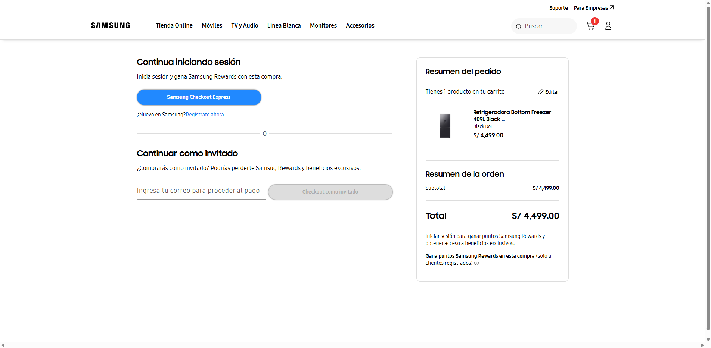

---

## 05 — Checkout Personal Information

The checkout page is loaded and the customer personal information section is available.

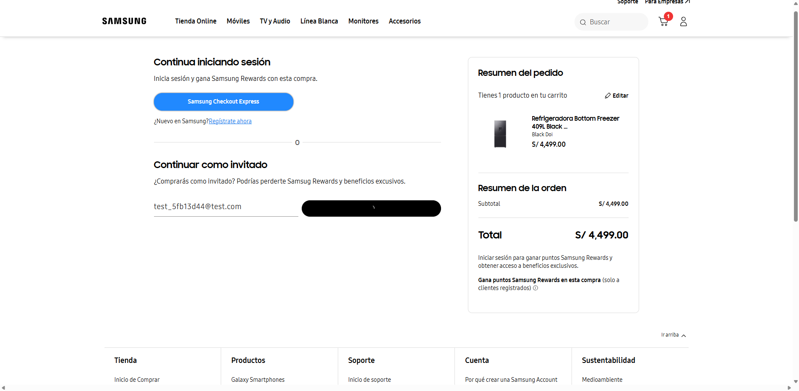

---

## 06 — Delivery Section

After completing personal information, the delivery address section becomes available.

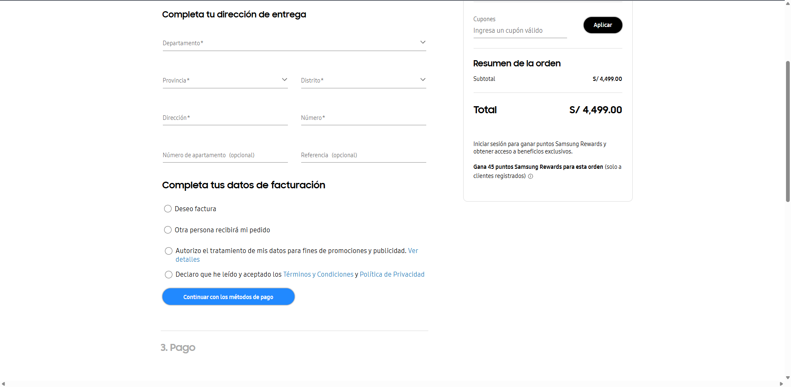

---

## 07 — Delivery Mode Selected

The delivery address is completed and a delivery mode is selected.

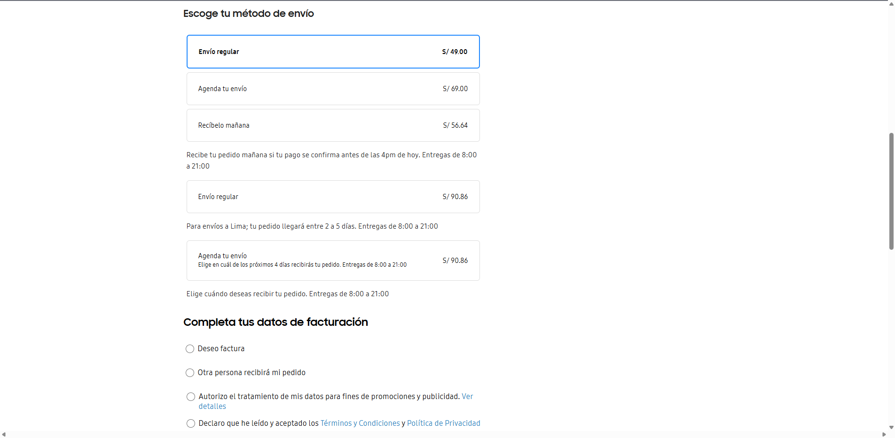

---

## 08 — Required Terms Accepted

The required terms and conditions checkbox is accepted before continuing to payment.

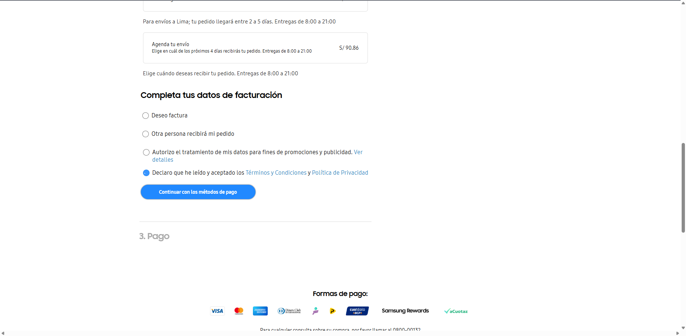

---

## 09 — Payment Section

The checkout flow advances to the payment section.

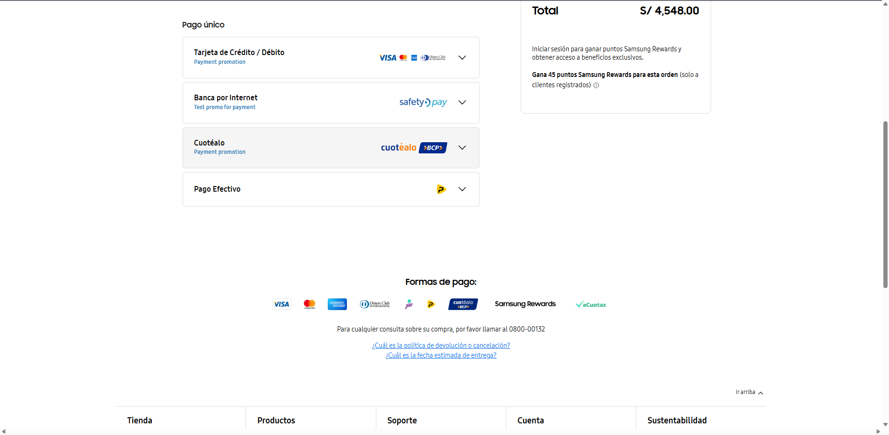

---

## 10 — Credit Card Payment Opened

The credit/debit card payment accordion is expanded.

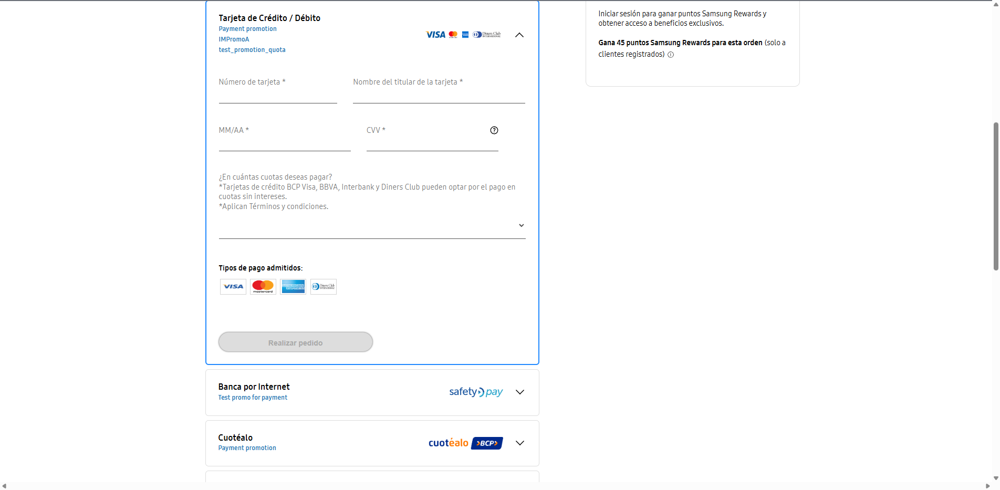

---

## 11 — Payment Fields Completed

The automation completes the payment card fields using the configured test data.

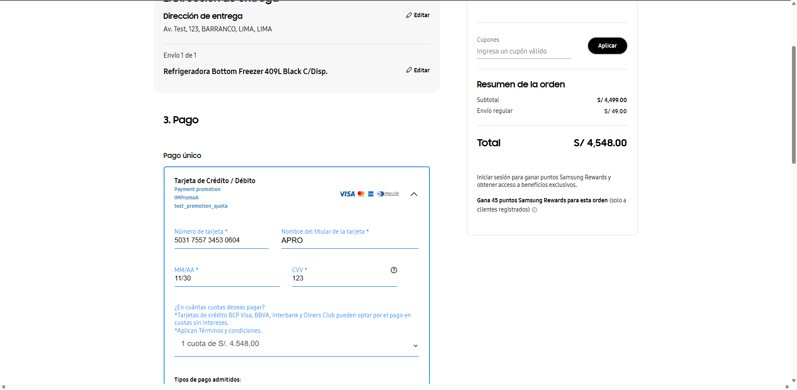

---

## 12 — Order Submission

The order is submitted through the **Realizar pedido** action.

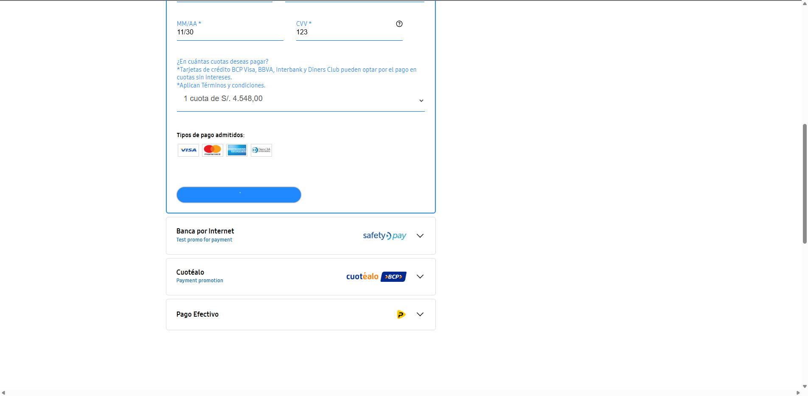

---

## 13 — Order Confirmation

The confirmation page is displayed and the generated order number is captured.

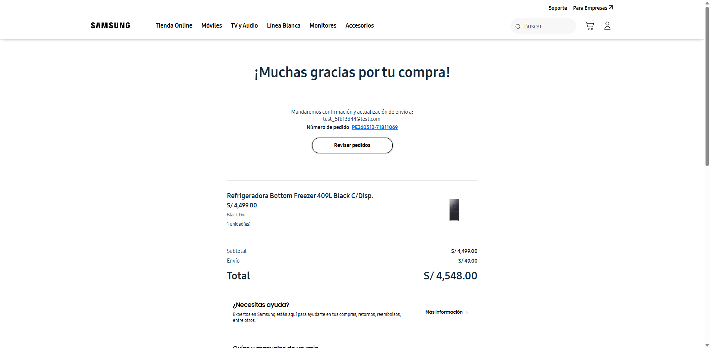

---

# Design Decisions

## Why Use The Provided Add-To-Cart Endpoint?

Instead of navigating through product listing or PDP screens, the framework intentionally uses the provided endpoint to insert the SKU into the cart.

This approach:

- Reduces setup time
- Reduces UI flakiness outside the assignment focus
- Keeps the automation centered on checkout behavior
- Mirrors common enterprise E2E test setup strategies

---

## Why Use Page Object Model?

Page Object Model was selected to:

- Centralize page behavior and locators
- Improve readability of the test case
- Reduce duplicated interaction logic
- Keep the test flow focused on business intent
- Simplify future maintenance

---

## Why Generate Dynamic Emails?

The assignment highlighted support for parallel execution.

Dynamic guest e-mail generation helps avoid:

- Duplicate e-mail conflicts
- Reused data collisions
- Session contamination
- Test instability during repeated runs

---

# Notable Automation Challenges Solved

During implementation, the framework was refined against real storefront behavior, including:

- Dynamic staging storefront rendering
- Cart page load timing
- Guest flow navigation
- Angular-style dropdown interactions
- Dependent address dropdowns
- Checkout sections that become enabled progressively
- Delivery mode selection through visual card targeting
- Required terms checkbox interaction
- Payment accordion loading behavior
- Mercado Pago card fields requiring precise interaction targeting
- Confirmation page wait and order-number extraction

These refinements resulted in a complete passing end-to-end checkout test.

---

# How To Run The Project

## Prerequisites

Install:

- Java 17+
- Maven
- Google Chrome
- IntelliJ IDEA, recommended

---

## Clone Repository

```bash
git clone https://github.com/crymydyne/samsung-checkout-automation
```

---

## Install Dependencies

```bash
mvn clean install
```

---

## Run All Tests

```bash
mvn test
```

---

## Run The End-To-End Checkout Test

```bash
mvn test -Dtest=CheckoutTest
```

---

# Screenshots Folder

Automated execution screenshots are stored inside:

```text
/screenshots
```

The screenshot utility uses deterministic screenshot filenames so a final successful run produces a clean ordered evidence set.

---

# Test Result

Final successful execution:

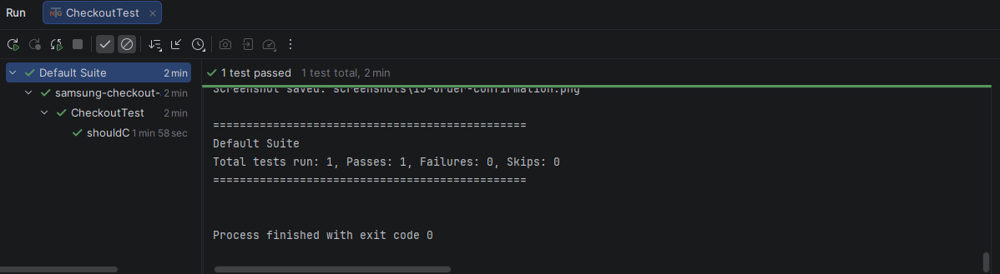

The end-to-end checkout flow successfully places an order and validates the final confirmation page.

---

# Future Improvements

Potential future improvements include:

- Parallel execution support
- Cross-browser execution
- API validation for backend order creation
- Data-driven test execution
- Headless execution toggle
- Richer reporting integration
- CI/CD pipeline integration
- Negative scenarios such as declined cards or unavailable delivery areas

---

# Final Notes

This project demonstrates a full automated guest checkout flow in Samsung's staging ecommerce environment, from session initialization through order confirmation.

The final framework provides:

- A structured automation architecture
- Clear business flow coverage
- Stable Page Object organization
- Real end-to-end checkout execution
- Visual evidence through screenshots
- Confirmation page validation
- Order number capture
