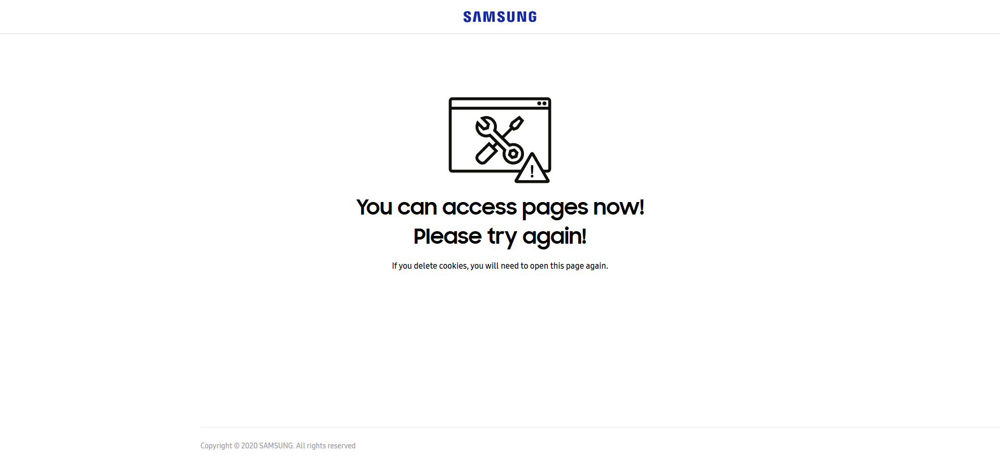
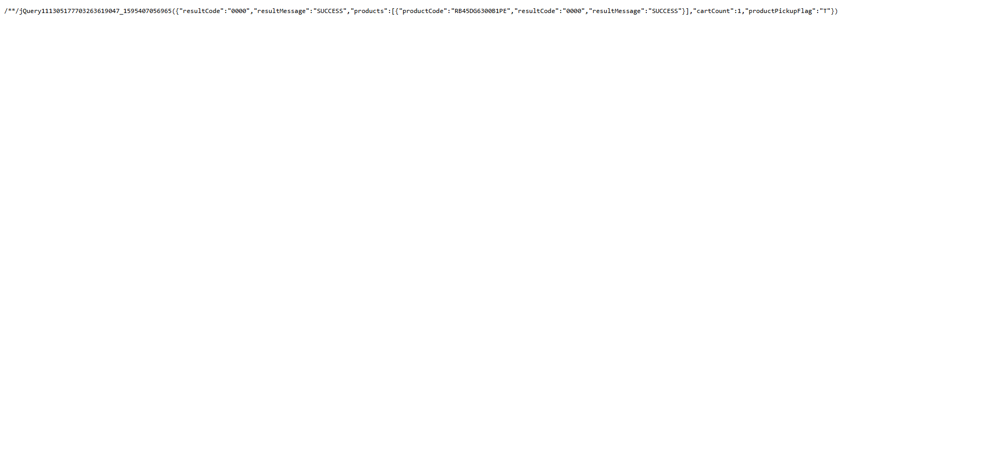
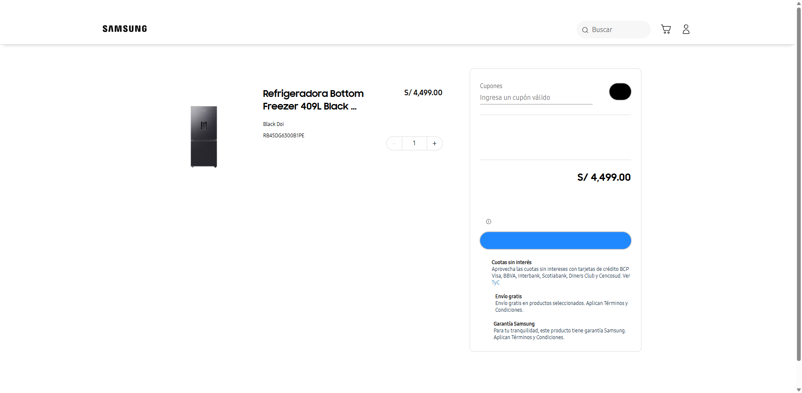
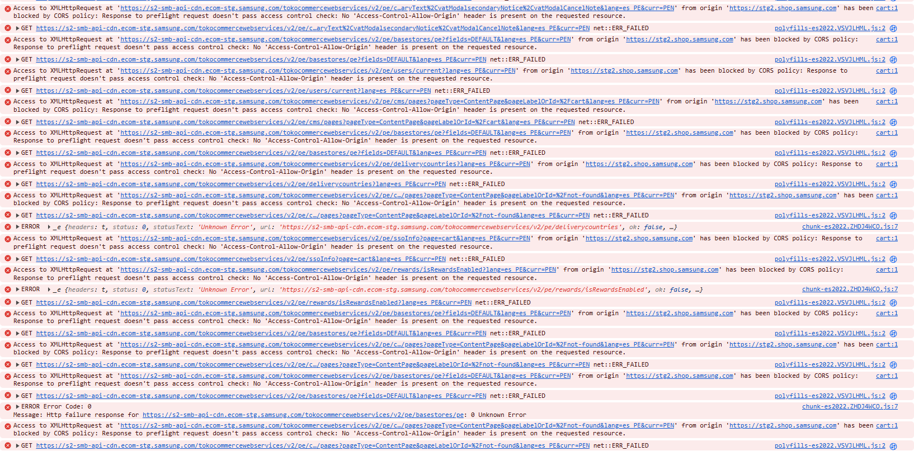
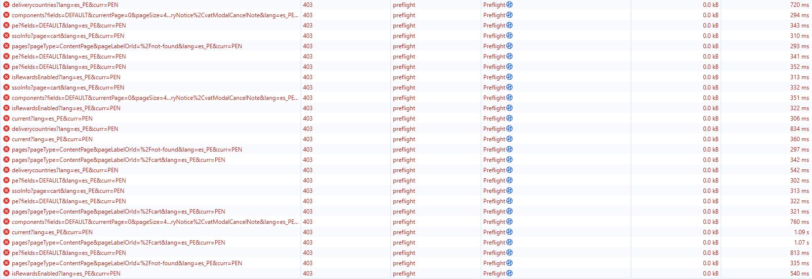
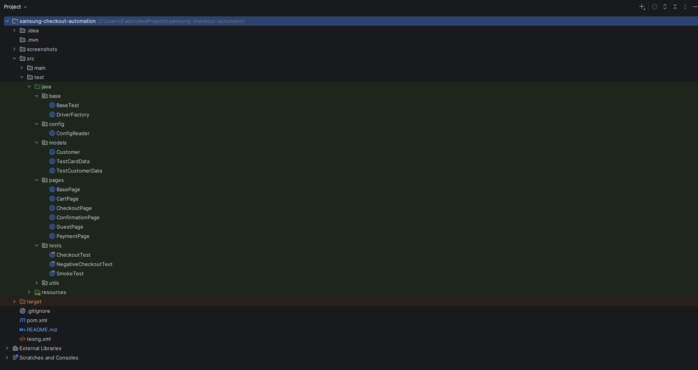
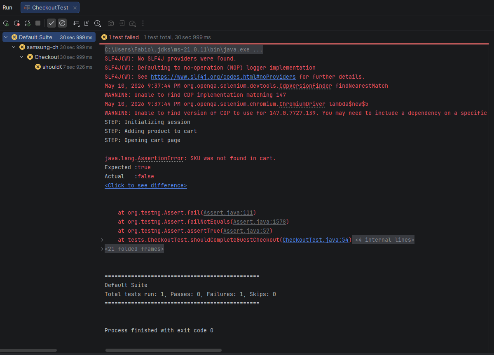

# Samsung Checkout Automation Framework

## Overview

This project is an automation framework created for the Samsung ecommerce checkout assignment.

The objective is to automate the customer checkout flow in Samsung's staging ecommerce environment, validating that a customer can:

- Add a SKU to the cart
- Proceed through checkout as a Guest user
- Fill personal information
- Fill address information
- Select delivery mode
- Complete payment using test credit cards
- Validate successful order placement
- Capture the generated order number

The framework was developed using Selenium WebDriver with Java and follows the Page Object Model (POM) architecture.

---

# Technologies Used

| Technology         | Purpose                             |
|--------------------|-------------------------------------|
| Java               | Programming language                |
| Selenium WebDriver | Browser automation                  |
| TestNG             | Test execution framework            |
| Maven              | Dependency management               |
| WebDriverManager   | Automatic browser driver setup      |
| IntelliJ IDEA      | Development environment             |
| Git + GitHub       | Version control                     |
| Chrome DevTools    | Environment investigation/debugging |

---

# Framework Architecture

The framework follows a Page Object Model (POM) design pattern to improve maintainability, scalability and readability.

## Project Structure

```text
src/test/java
│
├── base
│   ├── BaseTest.java
│   └── DriverFactory.java
│
├── config
│   └── ConfigReader.java
│
├── models
│   ├── TestCardData.java
│   └── TestCustomerData.java
│
├── pages
│   ├── BasePage.java
│   ├── CartPage.java
│   ├── GuestPage.java
│   ├── CheckoutPage.java
│   ├── PaymentPage.java
│   └── ConfirmationPage.java
│
├── tests
│   ├── SmokeTest.java
│   ├── CheckoutTest.java
│   └── NegativeCheckoutTest.java
│
└── utils
    ├── ScreenshotUtils.java
    ├── TestDataGenerator.java
    └── ConfigReader.java
```

---

# Framework Features

## Implemented Features

- Selenium WebDriver integration
- TestNG test execution
- Page Object Model architecture
- Centralized driver management
- Dynamic email generation using timestamp/UUID
- Screenshot capture utility
- Screenshot-on-failure support
- Reusable wait methods
- Reusable page actions
- Configurable environment URLs
- Structured test data models
- Checkout flow abstraction
- Negative scenario placeholders
- Business requirement traceability

---

# Business Flow Coverage

The framework was designed to cover the following business flow:

```text
Initialize ecommerce session
↓
Add SKU directly into cart using API endpoint
↓
Open cart page
↓
Validate SKU presence
↓
Proceed as guest user
↓
Fill personal information
↓
Validate address section enablement
↓
Fill address information
↓
Select delivery mode
↓
Enter payment information
↓
Place order
↓
Validate confirmation page
↓
Capture order number
```

---

# Environment Investigation

Before implementing the automation flow, exploratory investigation was performed on the staging environment.

## Investigated URLs

### Cookie Initialization Page

```text
https://stg2.shop.samsung.com/getcookie.html
```

Purpose:
- Initializes ecommerce session cookies
- Grants storefront access

### Add-To-Cart Endpoint

```text
https://stg2.shop.samsung.com/pe/ng/p4v1/addToCart
```

Purpose:
- Adds the desired SKU directly into the cart session
- Reduces UI dependency and improves execution stability

Observed Response:

```json
{
  "resultCode":"0000",
  "resultMessage":"SUCCESS"
}
```

### Cart Page

```text
https://stg2.shop.samsung.com/pe/cart
```

Purpose:
- Opens the storefront cart page
- Allows continuation into checkout

---

# Execution Evidence

## 01 — Session Initialization

Description:

The cookie initialization page was successfully loaded and session cookies were created.

Evidence:



---

## 02 — Product Added To Cart

Description:

The add-to-cart API endpoint successfully added the SKU into the cart session.

Evidence:



---

## 03 — Cart Page Access

Description:

The automation attempted to open the cart page after successful session initialization and cart insertion.

The storefront rendered as a blank page due to backend/API communication failures in the staging environment.

Evidence:



---

## 04 — Browser Console Investigation

Description:

Chrome DevTools console logs revealed frontend/backend integration failures related to CORS policies and blocked API requests.

Observed Issues:
- CORS policy failures
- Blocked preflight requests
- HTTP 403 responses
- Frontend rendering interruption

Evidence:



---

## 05 — Network Investigation

Description:

Network analysis showed failed requests targeting Samsung staging commerce APIs.

Observed Issues:
- Failed commerce API requests
- HTTP 403 responses
- Blocked backend endpoints
- Incomplete storefront rendering

Evidence:



---

## 06 — Project Structure

Description:

Framework organization and Page Object Model architecture inside IntelliJ IDEA.

Evidence:



---

## 07 — Test Execution

Description:

Execution logs and test runner behavior during automation execution.

Evidence:



---

# Environment Stability Findings

During exploratory investigation and automation execution, the staging environment presented instability related to frontend/backend communication.

## Observed Issues

- Blank storefront rendering
- CORS policy failures
- HTTP 403 preflight request failures
- Blocked commerce API requests
- Frontend rendering interruption

## Technical Observation

Requests targeting Samsung staging commerce APIs were blocked by access-control restrictions, preventing proper Angular storefront rendering.

Observed failing endpoint examples included:

```text
s2-smb-api-cdn.ecom-stg.samsung.com
```

## Impact

The Selenium framework itself remains functional and successfully executes:

- Session initialization
- API-assisted cart setup
- Screenshot capture
- Test execution
- Framework utilities
- Logging
- Failure handling

Full checkout completion currently depends on staging environment stabilization and restoration of storefront API communication.

---

# Design Decisions

## Why Use The Add-To-Cart API?

Instead of automating product navigation manually, the provided add-to-cart endpoint was intentionally used to:

- Reduce test execution time
- Reduce UI flakiness
- Improve test stability
- Focus automation effort on checkout behavior

This mirrors common enterprise automation practices.

---

## Why Use Page Object Model?

Page Object Model was selected to:

- Improve maintainability
- Centralize locators
- Reduce duplicated code
- Improve readability
- Improve scalability

---

## Why Generate Dynamic Emails?

The assignment explicitly mentioned support for parallel execution.

Dynamic email generation prevents:

- Duplicate user conflicts
- Session collisions
- Data reuse problems

---

# Assignment Requirements Coverage

| Requirement                    | Status                |
|--------------------------------|-----------------------|
| Selenium automation framework  | Implemented           |
| Guest checkout structure       | Implemented           |
| Screenshot support             | Implemented           |
| Dynamic email generation       | Implemented           |
| Page Object Model              | Implemented           |
| Add-to-cart API usage          | Implemented           |
| Checkout flow structure        | Implemented           |
| Order confirmation validation  | Structured            |
| Order number capture           | Structured            |
| Negative scenario preparation  | Implemented           |
| Parallel execution preparation | Partially implemented |
| Environment investigation      | Implemented           |

---

# How To Run The Project

## Prerequisites

Install:

- Java 17+
- Maven
- Google Chrome
- IntelliJ IDEA (recommended)

---

## Clone Repository

```bash
git clone <repository-url>
```

---

## Install Dependencies

```bash
mvn clean install
```

---

## Run Tests

### Run All Tests

```bash
mvn test
```

### Run Specific Test

```bash
mvn test -Dtest=CheckoutTest
```

---

# Screenshots Folder

Execution screenshots are automatically stored inside:

```text
/screenshots
```

Manual investigation screenshots are stored inside:

```text
/screenshots/manual-evidence
```

---

# Current Limitations

The following items currently depend on staging environment availability:

- Final locator refinement
- Checkout stabilization
- Payment iframe handling validation
- Final order placement validation
- Final order number capture

Placeholder locators are temporarily used in some Page Objects until the storefront stabilizes again.

---

# Planned Improvements

Future improvements may include:

- Parallel execution support
- Cross-browser execution
- API validation layer
- Data-driven testing
- Headless execution toggle
- Reporting integration
- CI/CD integration
- Enhanced negative scenarios

---

# Learning Outcomes

This project provided practical experience with:

- Selenium automation
- Framework architecture
- Page Object Model
- Maven dependency management
- Browser automation
- GitHub workflow
- Environment investigation
- Frontend/backend debugging
- Automation best practices
- QA engineering mindset

---
## Environment Note

During development and execution, the Samsung staging storefront experienced intermittent backend/API instability, including CORS and HTTP 403 failures affecting storefront rendering.

Despite these environment limitations, the automation framework architecture, execution flow, investigation process, and supporting utilities were fully implemented and documented.

---
# Final Notes

Even with staging instability, the project successfully established:

- A scalable automation framework
- Structured Page Object architecture
- Checkout automation flow
- API-assisted cart initialization
- Environment investigation documentation
- Reusable automation utilities
- Assignment requirement traceability

The framework is prepared for rapid completion once the staging environment becomes stable again.

